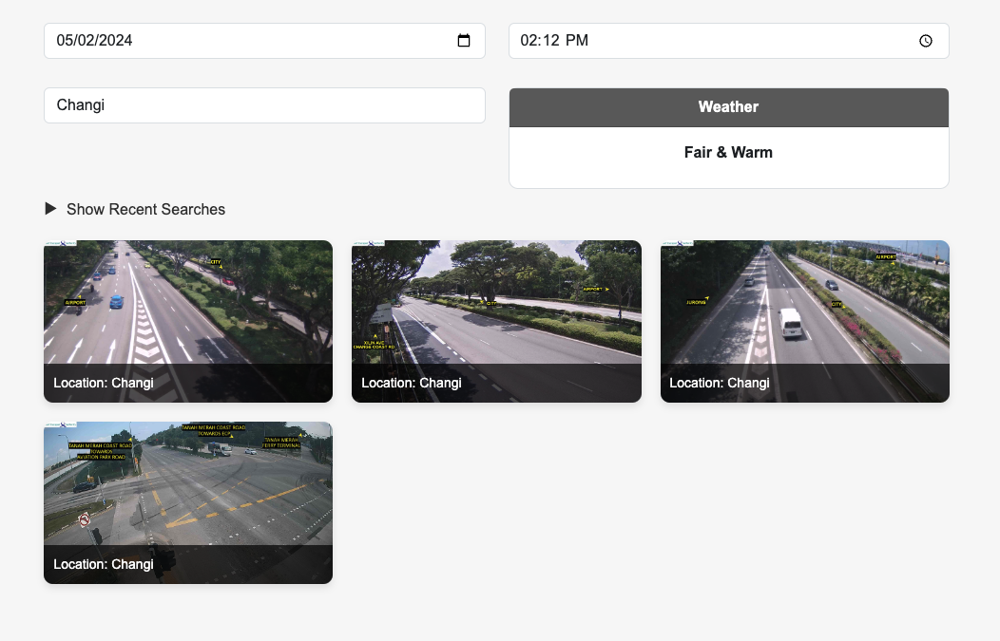

# Traffic Weather Data App

# Assumptions and Technical Design

## Assumptions

### User Identification:

The system assumes that user identification is necessary to log and track user searches. It generates a random username based on the user's IP address for anonymous users. However, this might not be a foolproof method, especially in cases of shared IPs or dynamic IPs.

### Data Availability:

The system assumes that traffic images and weather forecast data are available for the requested date and time. If data is unavailable, it returns an error message to the user.

### Data Consistency:

It is assumed that the format and structure of traffic images and weather forecast data from the external APIs remain consistent. Any changes in their structure might require corresponding updates in the application code.

### Caching:

The system assumes that caching the combined location data provides performance benefits and reduces API calls. However, it's based on the assumption that the data doesn't change frequently within the caching period.

## Technical Design

### Backend Architecture:

- **NestJS**: The backend framework used for building the RESTful API. It provides a modular and organized structure for developing scalable applications.
- **TypeORM**: Object-Relational Mapping (ORM) library for TypeScript and JavaScript. It simplifies database interactions and allows seamless integration with databases.
- **Axios**: HTTP client for making requests to external APIs. It offers features like promise-based requests and interceptors.
- **Cache Manager**: Utilized for caching combined location data, enhancing application performance by reducing redundant API calls.

### Frontend Architecture:

- **React**: JavaScript library for building user interfaces. It offers component-based architecture for building reusable UI components.
- **React Bootstrap**: UI library providing pre-designed components and styles for building responsive web applications.
- **API Integration**: Frontend communicates with the backend API using fetch requests to retrieve traffic and weather data based on user inputs.

### User Identification:

For anonymous users, a random username is generated based on their IP address to log and track their searches. This allows personalized experiences and analytics without requiring user registration.

### Caching Strategy:

Cached combined location data is stored using a cache manager. It helps in improving response times by serving previously computed results, reducing load on external APIs. Cache keys are generated based on the search timestamp.

### Error Handling:

The system handles errors gracefully, providing meaningful error messages to users in case of data unavailability or API failures. Errors are logged for debugging purposes.

### Recent Searches:

The frontend maintains a list of recent searches in local storage. This feature allows users to quickly access their past searches and select locations from the history.

### Responsive Design:

The frontend application is designed to be responsive, providing optimal user experience across different devices and screen sizes.

## Run locally:

Detailed instructions on how to run the source code are available under frontend and backend readme files.