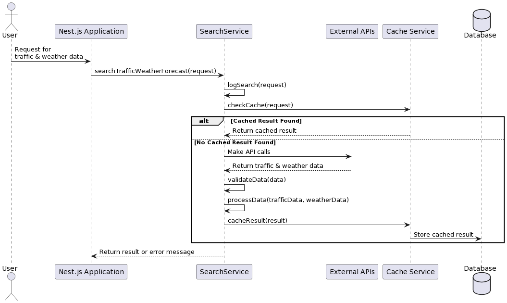
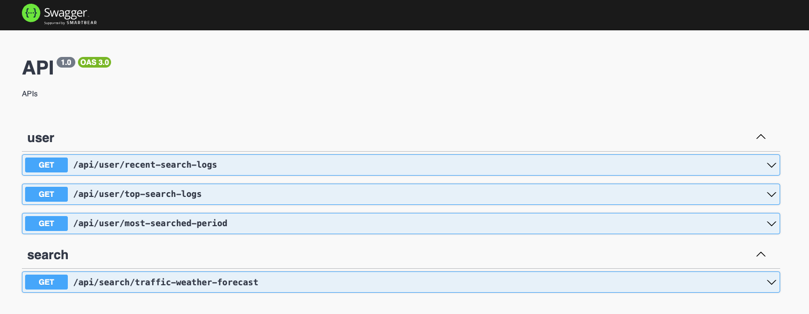

# Traffic and Weather Reporting Application

This repository contains a NestJS Node.js backend application for reporting traffic and weather data, along with user search logs. 

## Prerequisites

- Docker installed on your machine
- use nodejs 18 - nvm 18
- Access to PostgreSQL server

## API design



## APIs




## Installation

1. **Create a PostgreSQL Database:**

    Run the following command to create a PostgreSQL database named `monitor_log_db`:

    ```bash
    psql -U postgres -c "CREATE DATABASE monitor_log_db;"
    ```

2. **Set up Environment Variables:**

    Update the `.env` file with the appropriate values for your PostgreSQL database. Set the `PG_DB` variable to `monitor_log_db`.

3. **Build Docker Containers:**

    Run the following command to build the Docker containers:

    ```bash
    docker-compose build --no-cache
    ```

## Usage

1. **Run Docker Containers:**

    Once the containers are built, start the Docker containers by running:

    ```bash
    docker-compose up
    ```

    This command will start the backend application, and it will be accessible at `localhost:5000`.

2. **Access API Documentation:**

    The list of available APIs can be accessed via Swagger UI at:

    [http://localhost:5000/api](http://localhost:5000/api)

