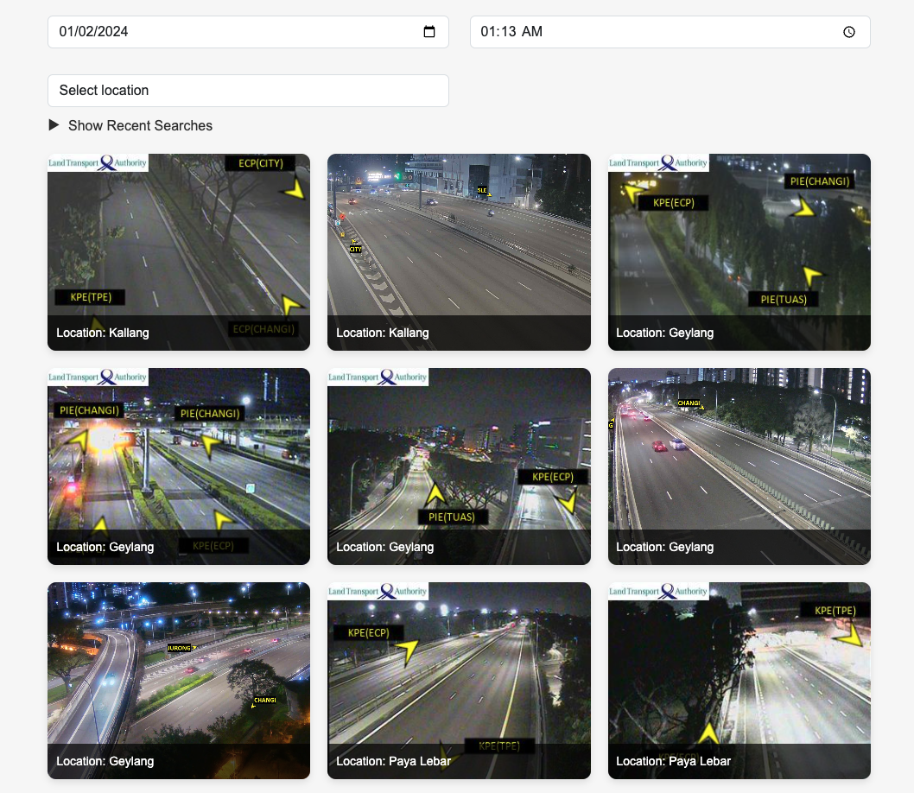

# TrafficWeather Forecast App

This project is a web application that provides real-time traffic and weather forecasts based on user-selected date, time, and location. It fetches data from a backend server and displays it to the user in a user-friendly interface.

## UI design



## Frontend Setup

1. Make sure you have Node.js 18 installed on your machine.

2. Navigate to the frontend directory of the project.

3. Run the following command to use Node version 18 (if you are using nvm):

    ```bash
    nvm use 18
    ```

4. Install the dependencies:

    ```bash
    npm install
    ```

5. Start the development server:

    ```bash
    npm run dev
    ```

6. Once the server is running, open your browser and go to [http://localhost:5173/](http://localhost:5173/) to view the app.

## Backend Setup
1. Ensure that the backend server is set up and running on your machine
2. Create a .env file in the backend directory if it doesn't already exist and set VITE_BACKEND_URL. For example:

    ```
    VITE_BACKEND_URL=http://localhost:5000
    ```

## Notes

- Make sure both the frontend and backend servers are running simultaneously to use the full functionality of the application.